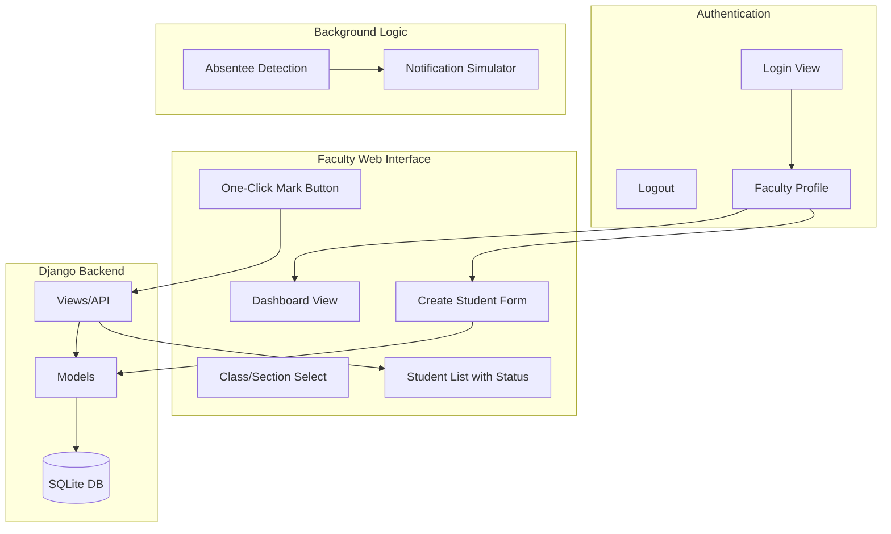
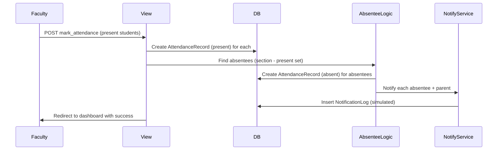

# Smart Attendance Management System

A Django-based web application for educational institutions to manage student attendance with faculty login, student management, and one-click attendance marking with automatic absentee notifications.

## Purpose

The Smart Attendance Management System helps educational institutions:

- **Faculty authentication** — Faculty members log in with credentials to access the system
- **Student management** — Create, list, and edit students with full contact details (email, phone, parent name, parent email, parent phone, address)
- **One-click attendance** — Mark attendance per section with "Mark All Present" or individual toggles
- **Absentee detection** — Automatically identifies students who were not marked present
- **Simulated notifications** — Logs simulated notifications to absentees and their parents (no real email sending; stored in `NotificationLog` for demo purposes)

## How It Works

### Architecture



### Authentication Flow

- Root (`/`) redirects to `/login/` if not authenticated, else to `/dashboard/`
- Faculty uses Django's `LoginView` with username and password
- **Register as faculty** — Public self-registration at `/register/` (no login required); creates User + Faculty profile
- After login → redirect to `/dashboard/`
- All faculty views require `@login_required`
- Logout → redirect to `/login/`

### Student CRUD

| Action  | URL                        | Description                          |
|---------|----------------------------|--------------------------------------|
| List    | `/students/`              | List all students; filter by section |
| Create  | `/students/create/`        | Add student with full contact info   |
| Edit    | `/students/<pk>/edit/`     | Update student contact details       |

- On create, `student.created_by` is set to the logged-in faculty member (audit trail)

### Attendance Flow (Mark → Detect Absentees → Simulate Notify)



1. Faculty selects a section from the dashboard and opens the mark attendance page
2. Faculty uses "Mark All Present" or individual toggles, then submits
3. View creates `AttendanceRecord` (status=present) for each marked student
4. Absentee detection compares section students vs. students with a record for that date; students without a record → absent
5. View creates `AttendanceRecord` (status=absent) for absentees
6. `simulate_notify_student()` and `simulate_notify_parent()` create `NotificationLog` entries (simulated; no real email sent)
7. Redirect to dashboard with success message

### Simulate Notification API

POST `/api/notifications/simulate/` with JSON body to trigger simulated notifications (for testing/demo).

**Mode 1 — By student ID** (sends to student + parent):
```json
{"student_id": 1, "date": "2025-02-22"}
```

**Mode 2 — Single notification**:
```json
{"recipient_email": "student@example.com", "recipient_type": "student", "student_name": "John Doe", "date": "2025-02-22"}
```
Use `"recipient_type": "parent"` for parent notifications.

Example:
```bash
curl -X POST http://127.0.0.1:8000/api/notifications/simulate/ \
  -H "Content-Type: application/json" \
  -d '{"student_id": 1}'
```

### Project Structure

```
smart-attendance/
├── manage.py
├── requirements.txt
├── README.md
├── config/                 # Django project config
│   ├── settings.py
│   ├── urls.py
│   └── wsgi.py
├── attendance/             # Main app
│   ├── models.py          # Faculty, Student, Course, Section, AttendanceRecord
│   ├── views.py           # Login, dashboard, student CRUD, mark attendance
│   ├── urls.py
│   ├── forms.py           # StudentCreateForm, StudentUpdateForm
│   ├── templates/
│   │   └── attendance/
│   │       ├── login.html
│   │       ├── base.html       # Nav with Dashboard, Students, Logout
│   │       ├── dashboard.html
│   │       ├── student_form.html
│   │       ├── student_list.html
│   │       └── mark_attendance.html
│   └── management/commands/
│       └── seed_data.py   # Seed sample data for testing
└── notifications/         # Simulated notification app
    ├── models.py          # NotificationLog (stores simulated sends)
    └── services.py        # simulate_notify_student, simulate_notify_parent
```

## How to Run

### Prerequisites

- Python 3.10+
- pip

### 1. Install Dependencies

```bash
cd smart-attendance
pip install -r requirements.txt
```

### 2. Apply Migrations

```bash
python manage.py migrate
```

### 3. Create Faculty Account(s)

**Option A: Create a superuser (admin + faculty)**

```bash
python manage.py createsuperuser
```

Set `is_staff=True` (superusers have this by default) so the user can access faculty views.

**Option B: Use seed data (includes sample faculty, courses, sections, students)**

```bash
python manage.py seed_data
```

This creates:
- Faculty users: `faculty1` / `faculty2` (password: `testpass123`)
- Courses: CS101, MATH201
- Sections: CS101-A, CS101-B, MATH201-A
- Sample students with full contact info

To reset and re-seed:

```bash
python manage.py seed_data --clear
python manage.py seed_data
```

### 4. Run the Development Server

```bash
python manage.py runserver
```

Open [http://127.0.0.1:8000/](http://127.0.0.1:8000/). You will be redirected to the login page if not authenticated.

### Quick Test (with seed data)

1. Run `python manage.py seed_data`
2. Run `python manage.py runserver`
3. Go to [http://127.0.0.1:8000/login/](http://127.0.0.1:8000/login/)
4. Log in as `faculty1` / `testpass123`
5. Use Dashboard → pick a section → Mark Attendance
6. Use "Mark All Present" or toggle students, then Save
7. Check Django admin for `NotificationLog` entries (absentees get simulated notifications)
